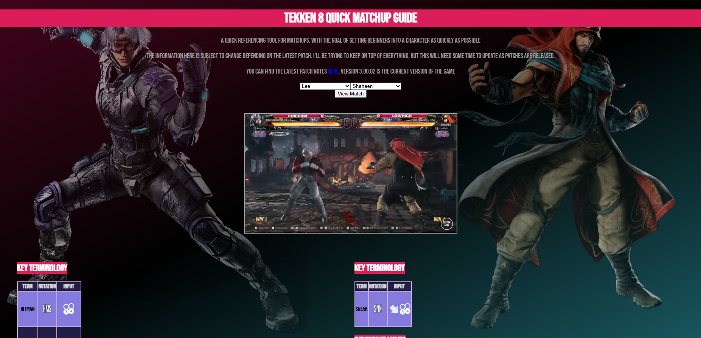
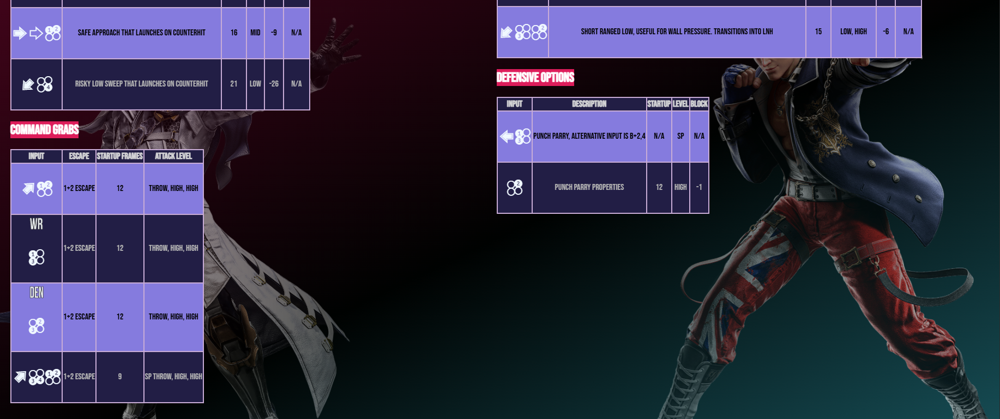

# Tekken 8 Quick Matchup Guide

A responsive web application designed as a quick-reference tool for beginner players and a utility for tournament commentators. This tool allows users to compare two characters side-by-side, providing key terminology, important moves, and defensive options instantly.

**Live Demo:** [wembembo.github.io/Tekken-Project-1.1/](https://wembembo.github.io/Tekken-Project-1.1/)

## 🚀 Features

- **Side-by-Side Matchup Data:** Compare frame data, key moves, and strategy for any two characters simultaneously.
- **Dynamic Backgrounds:** Character full-art portraits fade in and out behind the data tables based on your selection.
- **Pro Match Integration:** Search for and watch high-level professional replays of the specific matchup via the YouTube API.
- **Responsive Design:** Optimized for desktop viewing during play and mobile viewing for quick checks on the go.
- **Custom Notation Support:** Uses a specialized font to display Tekken directional inputs (e.g., d/f+2) in a clean, visual format.

## 🛠️ Tech Stack

- **Frontend:** HTML5, CSS3 (Flexbox/Grid), Vanilla JavaScript (ES6+).
- **Data:** JSON-based character library for easy updates and modularity.
- **API:** YouTube Data API v3.

## 🔑 Security & YouTube API Setup

To prevent API key leaks and unauthorized usage, the API key is **not** included in this repository. The video player functionality requires your own YouTube Data API key to work.

### How to add your API Key:
1. Obtain a key from the [Google Cloud Console](https://console.cloud.google.com/).
2. Open `index.js`.
3. Locate the `fetchYouTubeMatch` function.
4. Replace `'API KEY HERE'` with your actual key:
   ```javascript
   const API_KEY = 'YOUR_ACTUAL_KEY_GOES_HERE';
Note: It is highly recommended to use a .env file or restricted API keys if you plan on deploying this beyond a local environment.

## 📂 Project Structure
/Assets/Characters/Full-Art/: Contains high-resolution character portraits.

/char_data/: Contains individual .json files for each character's moves and frame data.

/Styles/: Contains custom typography including the Tekken notation font.

index.html: The main entry point and structure.

styles.css: Custom styling, including character fade animations and mobile media queries.

index.js: Logic for data fetching, UI updates, and API integration.

## 📸 Screenshots
### Data for each character in the game.


### Complete with video player that dynaicmally searches for videos using Youtubes API.


### Tables that adapt per character as needed, such as Lars and King having Command Grab tables in lieu of defensive options.
 

### Mobile View
Responsive design that makes this a single-player lookup tool on mobile devices. 


## 🤝 Contributing
This is an ongoing project. Future updates will include:

Updated data for the latest Tekken 8 patches (I got a little behind on this).

More robust data, I am considering an expansive mode that covers a character's entire movelist. 

A complete set of transparent portraits for each character and standardise the size for better formatting.

Project created by Tim Fitzgerald (@wembembo).
Notation font provided by @Theweirdologist.